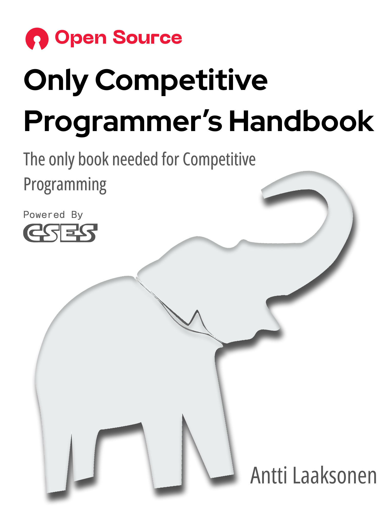

# Competitive Programmer's Handbook

Competitive Programmer's Handbook is a modern introduction to competitive programming.
The book discusses programming tricks and algorithm design techniques relevant in competitive programming.



## Getting the book

**Option 1 — download the prebuilt PDF.** Grab the latest ready-made copy from the
[Releases page](https://github.com/arihantdotcom/CPH/releases): check the release notes
of the latest release and download `Only Competitive Programmer's Handbook.pdf`
(the complete book with cover and back pages).

**Option 2 — build it yourself.** Get the code and generate it locally:

```
git clone https://github.com/arihantdotcom/CPH.git
cd CPH
./build.sh
```

Outputs: `book.pdf` (typeset book) and `Only Competitive Programmer's Handbook.pdf`
(book merged with cover and back pages).

Requirements:

- LuaLaTeX (TeX Live) with `makeindex`
- `qpdf` (for merging the cover, book, and back pages)
- Fonts: EB Garamond (TeX Live package), Open Sans Condensed (variable font,
  e.g. in `~/.local/share/fonts`), JetBrains Mono Nerd Font

## About this edition

This is **not the official repository**. The book was originally written by
Antti Laaksonen; the official source is at
https://github.com/pllk/cphb/.

This edition is redesigned by Arihant Jain to improve accessibility and clarity, and to show
creativity in a minimalist experience of reading a book. The text remains identical to the
official repository.

- **Page size**: 7 × 9.1875 in (504 × 661.5 pt)
- **Font families**: body text EB Garamond, headings Open Sans Condensed (ExtraBold), code
  JetBrains Mono Nerd Font
- **Cover & back pages**: designed externally as separate assets
  (`assets/cover.pdf` — front cover and inner title; `assets/back.pdf` — back cover),
  merged with the typeset book via `qpdf`. Cover design fonts: Open Sans Condensed,
  Red Hat Display, PP Neue Machina, Fonetika Mono

### Building

The PDFs are auto-generated from the sources in this repository — `book.pdf` and
`Only Competitive Programmer's Handbook.pdf` are not checked in. Build them yourself:

```
./build.sh
```

Outputs:

- `book.pdf` — the typeset book (292 pages)
- `Only Competitive Programmer's Handbook.pdf` — the final book: cover, inner title,
  typeset book, and back cover merged (295 pages)

To rebuild only one chapter: `./build.sh 7`

## CSES Problem Set

The CSES Problem Set contains a collection of competitive programming problems.
You can practice the techniques presented in the book by solving the problems.

https://cses.fi/problemset/

## License

The license of the book is [Creative Commons BY-SA 4.0.](./LICENSE)

